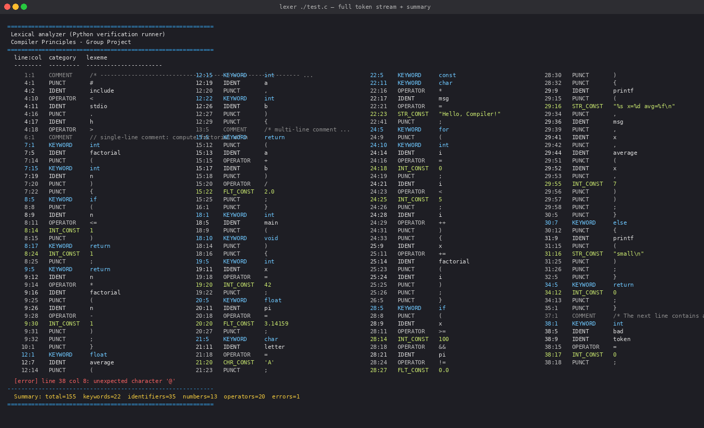
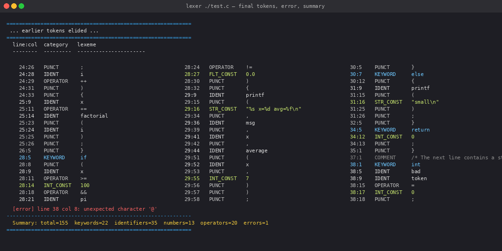
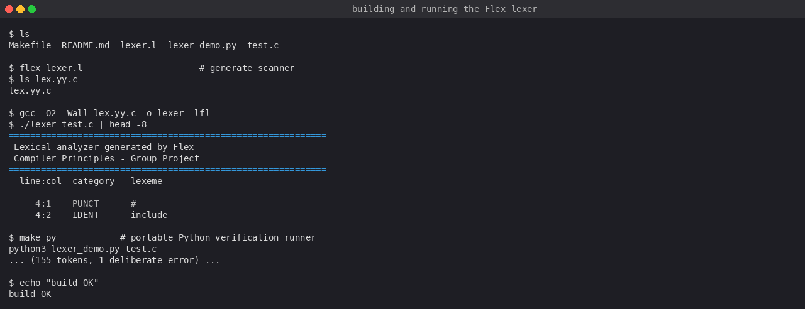

# Lexer — Automatic Lexical Analysis with Flex

> A scanner for a C-like language built using Flex (the automatic DFA generator) — outputs typed tokens with precise line/column positions. Includes a portable Python verification runner that produces identical output without any C toolchain.


-lightgrey)


---

## What It Does

The lexer reads a C-like source file and produces a stream of typed tokens — one per line — with the format `line:col  CATEGORY  lexeme`. It recognises keywords, identifiers, integer and float constants, string and character literals, operators (including multi-character ones like `<=`, `&&`, `++`), punctuation, and comments. Lexical errors are reported with exact source location.

The core deliverable is a **Flex specification** (`lexer.l`). Flex compiles it into a table-driven deterministic finite automaton (DFA) in C. We never hand-code the DFA — the point is to demonstrate how formal regular expressions drive the automatic generation of a fast scanner.

---

## Screenshots

| Token stream (part 1) | Token stream (part 2) | Build & run |
|---|---|---|
|  |  |  |

---

## Token Categories

| Category | Examples |
|---|---|
| `KEYWORD` | `if` `else` `while` `for` `return` `int` `float` `void` `struct` `sizeof` |
| `IDENT` | `factorial` `pi` `letter` `n` |
| `INT_CONST` | `42` `0` `100` |
| `FLT_CONST` | `3.14159` `2.718e+0` |
| `STR_CONST` | `"Hello, Compiler!"` |
| `CHR_CONST` | `'A'` `'\n'` |
| `OPERATOR` | `+` `-` `*` `/` `==` `!=` `<=` `>=` `&&` `\|\|` `++` `--` `+=` |
| `PUNCT` | `(` `)` `{` `}` `[` `]` `;` `,` `.` `:` |
| `COMMENT` | `// ...` and `/* ... */` |
| `[error]` | any unrecognised character (with location) |

---

## Result on `test.c`

```
Summary: total=155  keywords=22  identifiers=35  numbers=13  operators=20  errors=1
```

The single error is a deliberate stray `@` we inserted to demonstrate error recovery — the scanner reports `line 38 col 8` and continues tokenising normally.

---

## Example

**Input** (`example.c`):

```c
int x = 10;
if (x > 5) {
    x = x + 1;
}
```

**Output**:

```
1:1    KEYWORD     int
1:5    IDENT       x
1:7    OPERATOR    =
1:9    INT_CONST   10
1:11   PUNCT       ;
2:1    KEYWORD     if
2:4    PUNCT       (
2:5    IDENT       x
2:7    OPERATOR    >
2:9    INT_CONST   5
2:10   PUNCT       )
2:12   PUNCT       {
3:5    IDENT       x
3:7    OPERATOR    =
3:9    IDENT       x
3:11   OPERATOR    +
3:13   INT_CONST   1
3:14   PUNCT       ;
4:1    PUNCT       }

Summary: total=19  keywords=2  identifiers=4  numbers=2  operators=4  errors=0
```

---

## How to Build and Run

### Option A — Flex + GCC (primary)

```bash
flex lexer.l                    # generates lex.yy.c
gcc  lex.yy.c -o lexer -lfl    # macOS: replace -lfl with -ll
./lexer test.c
```

Or with the Makefile:

```bash
make          # build
make run      # build + scan test.c
make clean    # remove generated files
```

### Option B — Python runner (no C toolchain needed)

```bash
python3 lexer_demo.py test.c
```

The Python script implements the **same regular expressions** in the same priority order as `lexer.l`. Output format and token counts are identical — we use it as a regression check on the Flex specification.

---

## Project Layout

```
lexer-project/
  lexer.l           # Flex specification — primary deliverable
  test.c            # sample input covering every token category
  Makefile          # build / run / clean
  lexer_demo.py     # Python verification runner (same regexes, same output)
  output.txt        # captured token stream for test.c
  summary.md        # test-case analysis and observations
  screenshots/      # terminal screenshots referenced in slides
  slides.pptx       # project presentation
```

---

## How Flex Works (the key idea)

A Flex `.l` file has three sections:

```
%{ ... %}            ← C declarations and #includes
%%
REGEX  { action; }   ← one rule per token; Flex picks the longest match
%%
int main() { ... }   ← driver code
```

Flex reads the rules, builds a DFA, and emits an optimised C file (`lex.yy.c`). The DFA runs in O(n) time over the input — each character is visited exactly once. Multi-character operators are placed *before* single-character ones so Flex's longest-match rule picks `<=` over `<` followed by `=`.

---

## Test Program Design

`test.c` is written to hit every rule at least once:

| Construct | Token exercised |
|---|---|
| `#include <stdio.h>` | `#`, identifiers, `<`, `>` |
| `// single-line comment` | line comment rule |
| `/* multi-line comment */` | block comment, multi-line column tracking |
| `int factorial(int n)` | keyword, identifier, punctuation |
| `if (n <= 1) return 1;` | `if`, `<=`, `return`, integer literal |
| `float pi = 3.14159;` | float literal |
| `char letter = 'A';` | character literal |
| `const char *msg = "Hello, Compiler!";` | string literal |
| `for (int i = 0; i < 5; i++)` | `for`, `++` |
| `int bad@token = 0;` | **deliberate `@` error** |

---

## What I Learned

- **DFA generation** — understanding that Flex converts regex rules into a state-transition table made the "how does a scanner run so fast?" question concrete; it's a lookup table, not recursive matching
- **Longest-match rule** — rule ordering matters: without placing `==` before `=`, the scanner produces two tokens instead of one
- **Line/column tracking** — maintaining position across multi-line block comments requires explicit `\n` counting in the comment rule's action; Flex doesn't do it automatically
- **Portable fallback** — writing the Python runner to mirror the Flex rules forced a precise understanding of each regex, which caught two ambiguities in early drafts

---

## My Role

Wrote the Flex specification (`lexer.l`), designed and implemented the `test.c` sample covering all token categories including deliberate error, wrote the Python verification runner (`lexer_demo.py`), and compiled the output analysis in `summary.md`.

---

## Team

| Member | Student ID |
|---|---|
| Bakbergen Amir | 202469990559 |
| Bakbergen Alen | 202469990562 |
| Huang Liu Diego David | 202469990549 |
| Liu Bryan | 202469990275 |

*Lab project — Compiler Principles course, Spring 2026*
